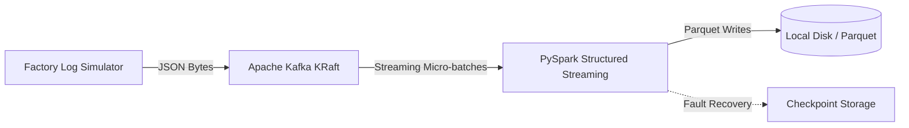

# Real-Time Event-Driven RAG Platform for Industrial Predictive Maintenance

An enterprise-grade, resource-constrained streaming pipeline designed to ingest, process, and index live machinery incident logs and telemetry alerts.

This platform acts as an intelligent assistant for factory technicians, dynamically matching real-time failure logs (from manufacturing lines) with relevant technical repair manuals using semantic search and Generative AI.

---

## 🏗️ System Architecture (Sprint 1 MVP)



This system is built using a decoupled, event-driven design to ensure high write-throughput, zero data-loss during traffic spikes, and low-latency processing boundaries.

---

## 💻 Tech Stack & Engineering Decisions

| Component | Technology | Rationale | Resource Constraints |
|---|---|---|---|
| Event Broker | Apache Kafka (KRaft Mode) | Acts as a shock absorber. KRaft mode removes Zookeeper overhead, saving JVM memory. | Hard-capped to 400MB RAM |
| Stream Engine | PySpark Streaming | Handles multi-threaded parsing, schema enforcement, and checkpointing. | JVM Heap limited to 1GB RAM |
| Vector Database | ChromaDB (v0.5.3) | Local vector store with persistent storage for low-latency semantic lookup. | Locked to 300MB RAM |
| Interoperability | Hadoop 3.3 Binaries | Windows POSIX compatibility shim (winutils.exe & hadoop.dll). | Localized within repo boundaries |

---

## 🚀 Quickstart: Local Setup & Running

This pipeline has been optimized to run safely on resource-constrained development machines (tested on 8GB RAM / Windows 11 with Java 17 LTS).

### 1. Prerequisites

Ensure you have the following installed on your host system:

- Docker Desktop
- Python 3.11
- OpenJDK 17 (Temurin LTS)

### 2. Environment Setup

```powershell
# Clone the repository
git clone https://github.com/<your-username>/realtime-event-rag.git
cd realtime-event-rag

# Create and activate virtual environment
python -m venv .venv
.venv\Scripts\Activate.ps1

# Install version-locked dependencies
pip install -r requirements.txt
```

### 3. Spin up Infrastructure (Kafka & ChromaDB)

Make sure Docker Desktop is active, then run:

```powershell
cd docker
docker compose up -d
```

Verify that both containers are active and constrained:

```powershell
docker ps
```

### 4. Launch the Streaming Pipeline (Side-by-Side Terminals)

**Terminal 1: Start the PySpark Consumer**

```powershell
python src/ingestion/consumer.py
```

*(Spark will initialize, bind the local Windows `hadoop.dll`, and wait for streaming data).*

**Terminal 2: Start the Simulated Log Producer**

```powershell
python src/ingestion/producer.py
```

*(The producer will start shipping synthetic JSON telemetry incidents to Kafka, acknowledged synchronously).*

---

## 🚦 Sprint 1 Deliverables (Completed)

- [x] **Lightweight Docker Infrastructure**: Deployed Kafka KRaft and ChromaDB with strict RAM budgets.
- [x] **Safe Asynchronous Producer**: Implemented Python simulator with synchronized write receipts (`acks=1`).
- [x] **Reliable PySpark Consumer**: Built structured stream processing with strict Schema Enforcement and Checkpointing for transactional crash-recovery.
- [x] **Hadoop POSIX Windows Shim**: Configured localized `winutils.exe` and `hadoop.dll` bindings.
